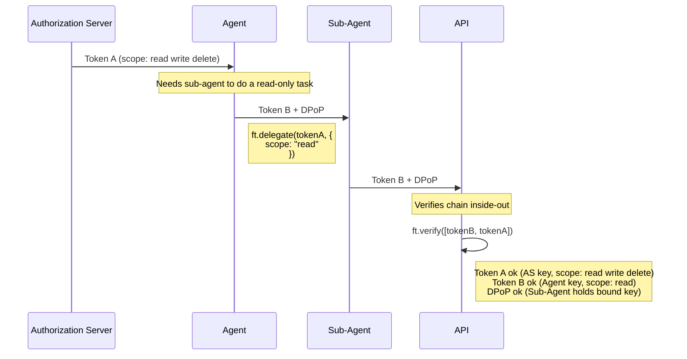
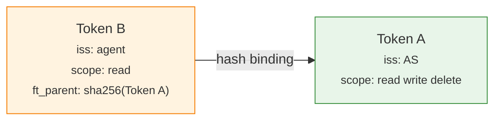

<p align="center">
  
</p>

<h1 align="center">french-toast-jwt</h1>

<p align="center">Client-to-client delegation for OAuth 2.0 — re-sign, attenuate, verify.</p>

## Why?

When an application or agent delegates a task to a sub agent, or sub task, it needs to pass along its authorization. Today, that means either handing off the full token or implementing multiple token exchange steps — and it's complex to track who delegated what along the way.

french-toast-jwt solves this. A client takes the original JWT, re-signs it with its own key, adds claims. The result is a verifiable delegation chain, each hop's identity and constraints are preserved, and the whole thing traces back to the original issuer.

Every token is DPoP-bound so only the intended presenter can use it.

**Example: An agent delegates a task to a sub-agent.**



The sub-agent only gets `read`. The API sees the full delegation chain — who delegated what to whom.



The library is claim-agnostic. It doesn't know about scopes, roles, or authorization_details. You add whatever claims you want; the verifier decides what they mean.

Keys are discovered automatically via [Authorization Server Metadata](https://datatracker.ietf.org/doc/html/rfc8414) and [Client ID Metadata Documents](https://datatracker.ietf.org/doc/draft-ietf-oauth-client-id-metadata-document/).

See [SPEC.md](SPEC.md) for the full specification.

## Install

```bash
npm install github:ciamshrek/french-toast-jwt
```

## Usage

### Delegate

```typescript
import * as ft from 'french-toast-jwt';

// Agent received tokenA from the AS.
// Delegate to sub-agent with narrower claims.
const tokenB = await ft.delegate(tokenA, {
  privateKey: agentPrivateKey,
  issuer: 'https://agent.example.com/client_id.json',
  audience: 'https://api.example.com',
  extraClaims: { scope: 'read' },
  nextHopPublicKey: subAgentPublicKey,
});
```

### Verify

The chain is passed as an array (outermost first, root last) or as an `&`-delimited string. Verification runs inside-out — if the root token is invalid, nothing else is checked.

```typescript
import * as ft from 'french-toast-jwt';

// API verifies the full chain.
const result = await ft.verify([tokenB, tokenA], {
  dpopProof,
  method: 'GET',
  url: 'https://api.example.com/resources',
});

// result.chain — decoded tokens from outermost to root
```

### Chain Constraints

Each token can restrict who can delegate further and how deep the chain can go, via headers that can only shrink:

```typescript
const tokenB = await ft.delegate(tokenA, {
  privateKey: agentPrivateKey,
  issuer: 'https://agent.example.com/client_id.json',
  audience: 'https://api.example.com',
  extraClaims: { scope: 'read' },
  // Only these issuers can appear downstream (ft_iss header)
  allowedIssuers: [
    'https://sub-agent-1.example.com/client_id.json',
    'https://sub-agent-2.example.com/client_id.json',
  ],
  // Allow at most 2 more delegations after this one (ft_dep header)
  maxDepth: 2,
});
```

Both are optional. If absent, issuers are unrestricted and depth is unbound. Each downstream hop can further reduce them but never expand.

### DPoP

Each hop presents its token with a DPoP proof per [RFC 9449](https://datatracker.ietf.org/doc/html/rfc9449). Standard DPoP — nothing custom.

```typescript
import * as ft from 'french-toast-jwt';

const proof = await ft.createDPoPProof({
  method: 'GET',
  url: 'https://api.example.com/resources',
  accessToken: chainString,  // the full & -delimited chain
  privateKey: presenterPrivateKey,
  publicKey: presenterPublicKey,
});
```

### HTTP

The full chain is transmitted in the Authorization header, tokens joined by `&`:

```http
GET /resources HTTP/1.1
Host: api.example.com
Authorization: DPoP <tokenB>&<tokenA>
DPoP: <dpop-proof>
```

## Examples

```bash
npx tsx examples/example1.ts   # Scope reduction at each hop
npx tsx examples/example2.ts   # Scope reduction + authorization_details
```

Both examples show the full flow with DPoP at every hop, metadata discovery logging, and raw token output.

## Stack

- [jose](https://github.com/panva/jose) — JWT signing, verification, JWKS, JWK thumbprints, DPoP

## License

MIT
