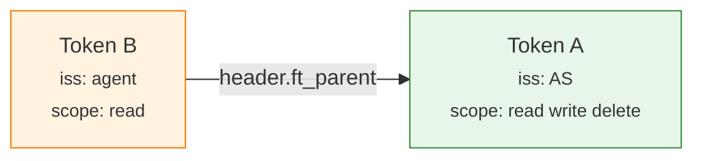

<p align="center">
  
</p>

<h1 align="center">french-toast-jwt</h1>

<p align="center">Client-to-client delegation for OAuth 2.0 — re-sign, attenuate, verify.</p>

## Why?

When an application or agent delegates a task to another, it needs to pass along its authority. But today, that means either handing off the full token or implementing multiple token exchange steps — and it's complex to track who delegated what along the way.

french-toast-jwt solves this. A service takes the original JWT, re-signs it with its own key, adds claims. The result is a verifiable delegation chain, each hop's identity and constraints are preserved, and the whole thing traces back to the original issuer. 

Every token is DPoP-bound so only the intended presenter can use it.

**Example: An agent delegates a task to a sub-agent.**


The sub-agent only gets `read`. The API sees the full delegation chain — who delegated what to whom.



The library is claim-agnostic. It doesn't know about scopes, roles, or authorization_details. Y

Keys are discovered automatically via [Authorization Server Metadata](https://datatracker.ietf.org/doc/html/rfc8414), [Client ID Metadata Documents](https://datatracker.ietf.org/doc/draft-ietf-oauth-client-id-metadata-document/), and [Protected Resource Metadata](https://datatracker.ietf.org/doc/html/rfc9728).

See [SPEC.md](SPEC.md) for the full specification.

## Install

```bash
npm install github:ciamshrek/french-toast-jwt
```

## Usage

### Delegate

```typescript
import * as ft from 'french-toast-jwt';

// Client1 received tokenA from the AS.
// Delegate to Client2 with narrower claims.
const tokenB = await ft.delegate(tokenA, {
  privateKey: client1PrivateKey,
  issuer: 'https://client1.example.com/client_id.json',
  audience: 'https://rs.example.com',
  extraClaims: {
    scope: 'read write',
  },
  nextHopPublicKey: client2PublicKey,
});

// Client2 delegates further to the RS.
const tokenC = await ft.delegate(tokenB, {
  privateKey: client2PrivateKey,
  issuer: 'https://client2.example.com/client_id.json',
  audience: 'https://rs.example.com',
  extraClaims: {
    scope: 'read',
    authorization_details: [{
      type: 'api_endpoint',
      actions: ['read'],
      locations: ['/users'],
    }],
  },
  nextHopPublicKey: client2PublicKey, // Client2 presents this token itself
});
```

### Verify

```typescript
import * as ft from 'french-toast-jwt';

// RS verifies the full chain (inside-out: root first, then each child).
const result = await ft.verify(tokenC, {
  dpopProof,
  method: 'GET',
  url: 'https://rs.example.com/users',
});

// result.chain — decoded tokens from outermost to root
// The RS reads claims at each depth and enforces its own policy.
```

### DPoP

Each hop presents its token with a DPoP proof per [RFC 9449](https://datatracker.ietf.org/doc/html/rfc9449). The library provides helpers, but it's standard DPoP — nothing custom.

```typescript
import * as ft from 'french-toast-jwt';

const proof = await ft.createDPoPProof({
  method: 'GET',
  url: 'https://rs.example.com/users',
  accessToken: tokenC,
  privateKey: client2PrivateKey,
  publicKey: client2PublicKey,
});
```

## Examples

```bash
npx tsx examples/example1.ts   # Scope reduction at each hop
npx tsx examples/example2.ts   # Scope reduction + authorization_details
```

Both examples show the full flow with DPoP at every hop, metadata discovery logging, and raw token output.

## License

MIT
